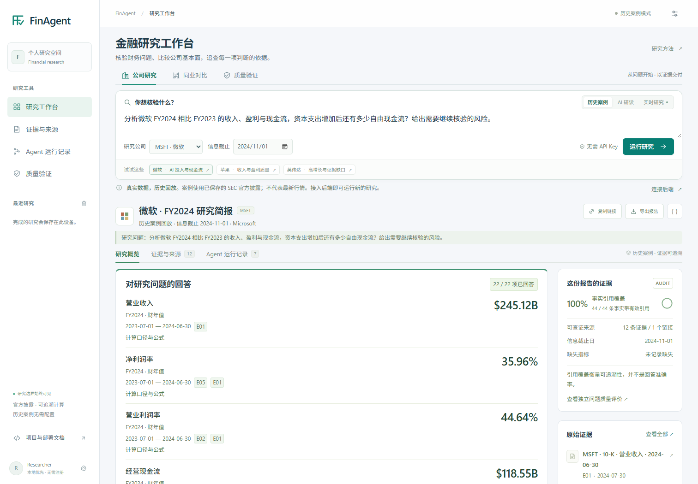
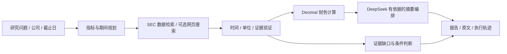
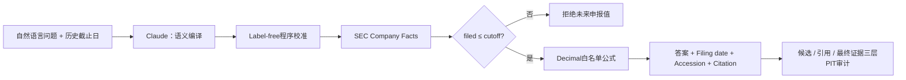

# FinAgent · 金融研究工作台

**从一个研究问题，到可核验的财务事实、研究摘要与条件判断。**

面向面试展示和单机研究部署的完整应用：浏览器工作台 + FastAPI 服务 + SEC 财报检索 + DeepSeek 证据编排 + 持久任务与审计轨迹。它把本仓库的金融搜索论文实践接到可操作的产品流程中。

[**立即体验 →**](https://qiqiyzhu.github.io/FinSearchComp-Audit/workbench/) · [项目首页](https://qiqiyzhu.github.io/FinSearchComp-Audit/) · [部署指南](docs/WORKBENCH_DEPLOY.md) · [90 秒面试讲解](docs/WORKBENCH_INTERVIEW.md) · [论文与产品依据](docs/WORKBENCH_RESEARCH.md)

[](https://codespaces.new/QiQiyzhu/FinSearchComp-Audit?quickstart=1)

> 在线体验使用有来源的历史财报快照，无需注册或 API Key。完整服务提供历史快照 + 真实 DeepSeek，以及 SEC 实时获取 + DeepSeek 两种模式；数据时间、模型调用和证据状态分别标注。

[](https://qiqiyzhu.github.io/FinSearchComp-Audit/workbench/)

[实际 DeepSeek 双公司操作录像](docs/assets/workbench/workbench-v2-demo.webm) · [真实调用与验证记录](docs/WORKBENCH_VERIFICATION.md)

**v2 工作台**：逐个子问题回答、可追溯公式、公司财务对比，以及单独呈现的[质量评测](docs/WORKBENCH_QUALITY.md)。[直接查看 Microsoft × Apple 对比](https://qiqiyzhu.github.io/FinSearchComp-Audit/workbench/?example=msft-aapl-comparison)；财年期间不同会明确提示，不用错位数据给公司排名。

40 道项目内冻结问题的首次评测，完整回答从 **50% → 95%**；首次保留集为 **18/20**。公开两道失败后的修复回归为 40/40，单独记录，不覆盖首评分数。这些结果不代表开放金融研究或投资判断准确率。

**Point-in-Time 研究试点**：[打开时点评测](https://qiqiyzhu.github.io/FinSearchComp-Audit/workbench/pit.html) · [给老师的研究方案](docs/PIT_RESEARCH_PROPOSAL.md) · [实验协议](docs/PIT_PILOT_PROTOCOL.md) · [复现实验](pit_benchmark/README.md)。围绕三家公司六道财报题，配对观察指定申报前后、三种证据条件下的真实模型回答；逐条保留时间、原始证据与运行记录。它是封闭材料的时点合规试点，尚不测量模型的精确训练截止日期。

## 给面试官的 3 分钟路径

1. **打开工作台**，选择公司研究或公司对比，先查看每个子问题的回答。
2. **点击证据**，核对原始申报链接、期间、申报时间、数据指纹和计算公式。
3. **打开质量验证**，比较旧版和新版在冻结问题上的表现；再展开执行轨迹或导出报告。
4. **运行完整服务**，连接自己的 DeepSeek 配置，换一个公司或历史截止日发起研究。

## 这次升级具体做了什么

| 产品能力 | 可检查的实现 |
|---|---|
| 搜索与提取 | SEC Company Facts，显式公司、财务标签、年度期间与 filing date；可选 Tavily 上下文 |
| 证据验证 | 截止日过滤、期间与单位检查、缺项拒答、来源 ID 与 SHA-256 |
| 计算与归纳 | Decimal 计算营收增长、利润率和现金流指标；模型在已验证事实范围内组织摘要 |
| 问题级回答 | 多指标、多操作分别回答；区分同比百分比、金额增量与利润率百分点变化 |
| 公司对比 | 独立发行人证据、命名空间引用、财年起止校验；缺失值不作零值处理 |
| 质量验证 | 冻结问题与独立财务答案，分别衡量取数、完整回答、拒答与时间边界 |
| 研究判断 | 支持因素、风险、条件与下一步；证据质量和市场预测分开 |
| 完整操作链 | 持久异步任务、幂等、容量限制、运行历史、故障状态与报告导出 |
| 部署体验 | GitHub Pages 免 Key 体验、Codespaces、Docker Compose、Windows 一键启动 |



## 运行

Python 3.11+：

```bash
pip install -r requirements-workbench.txt
python -m uvicorn research_workbench.api:create_app --factory --host 127.0.0.1 --port 8090
```

打开 **http://127.0.0.1:8090**。首次启动就能运行离线案例。Windows 可直接执行：

```powershell
powershell -ExecutionPolicy Bypass -File scripts/start-workbench.ps1
```

Docker：

```bash
docker compose up --build -d
```

真实模型模式先复制 `.env.example` 为 `.env`，设置 DeepSeek Key、开启 live，并按[配置说明](docs/WORKBENCH_DEPLOY.md)选择服务访问令牌或仅本机访问。前端不接收 DeepSeek Key。

## 验证与边界

- [验证记录](docs/WORKBENCH_VERIFICATION.md)与[质量评测](docs/WORKBENCH_QUALITY.md)：工程测试、实际模型调用与财务问答质量分别记录。
- 新工作台聚焦 **8 家美股公司、年度基本面研究**；未覆盖 A 股、实时股价、估值数据库或自动交易。报告中的判断是证据范围内的研究结论，不是回测证明的交易策略。
- SQLite 与进程内执行器面向单实例部署；多租户权限、队列集群、合规审计与服务等级保障属于后续工作。
- 论文迁移是工程方法吸收。原 ATLAS 的 20 题研究指标保留在[研究档案](https://qiqiyzhu.github.io/FinSearchComp-Audit/research.html)，**不代表新工作台的线上准确率**。

## 研究基础与原始实验

原有实验、负结果、证据与复现命令完整保留。以下是产品升级前的研究说明：

<details>
<summary>展开 FinSearchComp-Audit / ATLAS-PIT-XBRL 研究档案</summary>

## FinSearchComp-Audit · ATLAS-PIT-XBRL

> **让答案正确，也让每条证据在历史截止日之前真实可用。**

[](https://qiqiyzhu.github.io/FinSearchComp-Audit/)
[](temporal_clash/results/atlas_pit_xbrl_20q_sonnet5_20260813/README.md)
[](temporal_clash/results/atlas_pit_xbrl_20q_sonnet5_20260813/metrics.json)
[](temporal_clash/results/atlas_pit_xbrl_20q_sonnet5_20260813/metrics.json)
[](https://github.com/QiQiyzhu/FinSearchComp-Audit/actions/workflows/finsearch-audit.yml)

## 一句话成果

在20道全新的历史截止日SEC财报计算题上，使用同一个 `claude-sonnet-5`：

| 完整系统 | 数值准确率 | 回答覆盖率 | 候选未来来源 | 最终未来证据 | 联合可靠回答率 |
|---|---:|---:|---:|---:|---:|
| 普通 Web Search Agent | 65%（13/20） | 90% | 80/392 | 7/55 | 0% |
| **ATLAS-PIT-XBRL** | **100%（20/20）** | **100%** | **0/32** | **0/84** | **100%** |

数值逐题为 **7胜 / 13平 / 0负**，提升 **35个百分点**，配对bootstrap 95% CI为
**+15至+55个百分点**。普通Agent在19/20题的候选搜索结果中暴露确认的未来来源，并在6/20题
最终采用未来证据；ATLAS-PIT-XBRL两项均为0。

“联合可靠回答”要求答案正确，并且最终证据全部有日期、不晚于题目截止日、来源字段完整。
未知日期不算确认未来，但也不再被包装成确认安全。

- [在线结果首页](https://qiqiyzhu.github.io/FinSearchComp-Audit/)
- [20题答案与时间审计页](https://qiqiyzhu.github.io/FinSearchComp-Audit/xbrl-study.html)
- [正式研究卡](temporal_clash/results/atlas_pit_xbrl_20q_sonnet5_20260813/README.md)
- [逐题结果](temporal_clash/results/atlas_pit_xbrl_20q_sonnet5_20260813/case_outcomes.csv)
- [40条有效记录 + 1条排除记录](temporal_clash/results/atlas_pit_xbrl_20q_sonnet5_20260813/trace.jsonl)
- [Gold独立审计](temporal_clash/results/atlas_pit_xbrl_20q_sonnet5_20260813/gold_audit.json)
- [运行前协议与传输修订](docs/ATLAS_PIT_XBRL_20Q_PROTOCOL.md)

## 为什么旧的“泄漏为0”不够严格？

旧实验只把最终证据中“已经明确标注日期且晚于截止日”的记录计为泄漏。开放网页经常没有日期，
因此 `published_at=null` 会落在指标之外，看起来仍像“泄漏为0”。

新的独立 `pit-audit-1.0` 同时检查三层：

1. 搜索引擎返回的全部候选来源；
2. 模型原生引用；
3. 最终答案实际采用的证据。

它使用供应商返回的 `page_age` 与证据URL匹配日期，并把每条记录分为：截止日前、截止日后、日期未知。
普通Agent的候选来源时间元数据覆盖率为30.6%，ATLAS为100%；最终证据时间元数据覆盖率分别为
36.4%和100%。

其中Web来源日期是搜索供应商观察到的页面时间元数据，不等同于对所有网页完成独立取证；因此项目把它表述为
“供应商元数据确认的未来来源”。SEC filing date则来自官方Company Facts记录。

## ATLAS-PIT-XBRL 如何工作？



- Claude只识别公司、财务指标、财年与公式类型，不直接决定最终数字；
- 程序只选择截止日前已经提交的10-K年度事实；
- 文档版本同时保存 `published_at`、半开有效区间 `effective_from/effective_to` 与内容SHA-256；
- 每个事实保存US-GAAP taxonomy、filing date、accession和SEC响应SHA-256；
- Python `Decimal`执行固定公式，只在最后一步统一舍入；
- 日期缺失单独计为unknown，不算作确认安全。

## 公平性与防止事后改答案

20题、Gold、日期解析器、联合评分和六项成功条件在正式运行前冻结于提交 `7a138a3`。
Gold由独立程序重新调用SEC Company Facts复算，20/20通过，整批题集哈希为：

```text
a11e93b6974a2dd5d41c0e5de590e4dedaafc317827f2de9c34dd0f6c467172a
```

正式提示词不含 `gold_answer`、`gold_calculation` 或 `reference_program`，没有依据任一方法输出修改Gold。
第21个单元遇到一次HTTP 524，协议在 `ffda118` 记录“仅替代一次、累计尝试上限60→61”；原错误永久保留，
最终得到40/40条有效记录和1条公开排除记录，0条invalid。

这是完整Agent系统比较：两种方法使用同一模型和推理强度，但普通Agent使用通用Web Search，
ATLAS使用任务专用SEC工具。它不是“只换Prompt”的消融。

## 实验规模

| 项目 | 普通 Agent | ATLAS-PIT-XBRL |
|---|---:|---:|
| 有效运行 | 20 | 20 |
| 模型HTTP阶段 | 40 | 20 |
| 外部工具动作 | 50次Web Search | 16次SEC下载 + 68次缓存命中 |
| 候选来源 | 392 | 32个公司级SEC来源记录 |
| Citation | 83条原生Web citations | 84条SEC事实citations |
| 输入 / 输出tokens | 103,332 / 56,560 | 13,006 / 5,412 |
| 最终来源字段完整率 | 14.5% | 100% |

## 项目从失败到综合改进

| 阶段 | 真实结果 | 研究结论 |
|---|---|---|
| 2026-07 时间Gate | 严格方法20%，普通搜索50% | 网页缺日期导致过度拒答 |
| 校准ATLAS-RAG | ATLAS 45%，普通搜索55% | unknown与violation分开能改善Gate，但仍未超过普通搜索 |
| ATLAS-Fusion | 最终55%持平，草稿65% | 多轨迹找到互补证据，但Gate会丢掉正确答案 |
| ATLAS-Compute开发实验 | 50%，普通搜索66.7% | 程序化公式有效，Web仍缺一手操作数 |
| ATLAS-XBRL正式实验 | 100%，普通搜索75% | 官方结构化事实 + 程序计算解决数值误差 |
| **ATLAS-PIT-XBRL综合实验** | **准确率100% vs 65%；最终未来证据0 vs 7** | **准确率、覆盖率、搜索时间安全与最终证据安全同时改善** |

早期负结果没有删除，见[历史真实实验归档](#历史真实实验归档)。

## 顶会研究如何落地

| 顶会工作 | 本项目吸收的思想 | 工程实现 |
|---|---|---|
| [Query Decomposition for RAG, EACL 2026](https://aclanthology.org/2026.eacl-long.322/) | 复杂问题分解 | 2–8个有序财务事实请求 |
| [FinMRAGBench, Findings ACL 2026](https://aclanthology.org/2026.findings-acl.187/) | 财报多步工具推理 | SEC事实、accession、公式trace |
| [ChainRAG, ACL 2025](https://aclanthology.org/2025.acl-long.1089/) | 保持多跳实体链 | 显式公司、指标、期间和操作数顺序 |
| [FinGEAR, Findings EMNLP 2025](https://aclanthology.org/2025.findings-emnlp.382/) | 金融结构和术语映射 | US-GAAP taxonomy白名单路由 |
| [Sufficient Context, ICLR 2025](https://openreview.net/pdf?id=Jjr2Odj8DJ) | 区分上下文不足与使用失败 | unknown日期不计为安全，切换官方工具 |
| [FreshQA / FreshLLMs, Findings ACL 2024](https://aclanthology.org/2024.findings-acl.813/) | 动态知识新鲜度 | 从“现在正确”推进到“历史时点可用” |

本项目吸收设计原则，不声称复现这些论文的训练过程或公开指标。

## 代码与复现

### Agentic 评测：E4 Structured Gap Planner + E5 Sufficiency Gate + E6 Budget Sweep

ATLAS-RAG 新增了一个不依赖外部 LLM 的受控 Agent 评测层，用来回答三个可验证问题：系统能否显式知道
“还缺哪条证据”、能否在证据不足或冲突时正确拒答、以及提高检索预算是否还会继续带来收益。

| 实验 | 对照 | 完整方法 | 结果 |
|---|---|---|---|
| E4 Structured Gap Planner | 原问题 top-3 / rewrite 均为 75% | 逐槽检索 100% | 四槽问题不再漏操作数 |
| E5 Sufficiency Gate | must-answer 无依据回答率 66.7% | **0%** | 正确拒答 100%，false abstention 0% |
| E6 Budget Sweep | 最大调用预算 1 / 2 / 3 / 5 / 8 | 预算 5 首次 100% | 到预算 8，平均实际调用和成本代理保持不变 |

Planner 将问题编译为 `(company, metric, period, unit)` 证据槽；Gate 只接受截止日可见、`final`、
单位一致且无数值冲突的完整证据组；Budget Runner 每次只填一个缺口，一旦充分立即停止。

- [在线 E4–E6 结果页](https://qiqiyzhu.github.io/FinSearchComp-Audit/agentic-eval/)
- [Planner、Gate 与检索实现](advanced_rag/agentic.py)
- [冻结的 8 题合成数据](advanced_rag/agentic_cases.json)
- [聚合结果与逐题 CSV](advanced_rag/results/agentic/)
- [12 项 E4–E6 测试](advanced_rag/test_agentic_eval.py)

边界：这 8 题是机制测试用的合成金融 fixture，不代表真实发行人事实或生产流量；成本代理是固定公式，
不是 API token 账单或线上延迟。Query rewrite 在该协议中没有优于原问题检索，这一负结果也被原样保留。

### 工程平台：FinAgent Audit Platform

ATLAS-RAG 现在不仅能作为同步实验函数运行，还提供持久化的异步评测平台：

```text
Query / Batch Evaluation
        ↓
Idempotency + Config Hash
        ↓
SQLite Run Store（queued → running → succeeded / failed）
        ↓
Bounded Retry Worker → ATLAS-RAG → Failure Classifier
        ↓
Result + Versioned Trace + Failure Analytics + Replay Diff
```

- FastAPI 提供 query、job、trace、evaluation、failure analytics 和 replay 接口；
- 请求、数据集版本、Pipeline 版本与模型版本共同进入幂等和审计记录；
- 上游超时采用有限次指数退避，最终错误转成持久化失败 Run，不让整个 Batch 崩溃；
- Replay 创建新 Run，比较 old/new 的答案、证据选择、Agent 状态轨迹与结果哈希；
- 当前采用 SQLite WAL + 进程内线程池，明确记录进程退出恢复与多机扩展边界，没有为规模感强塞中间件。

离线平台演示固定运行 3 个 Case：正常回答、缺失证据拒答、首次超时后恢复，并验证幂等、失败分类与 Replay。

- [平台架构、API 与工程取舍](finagent_platform/README.md)
- [Run/Job/Replay 实现](finagent_platform/platform.py)
- [SQLite 幂等状态存储](finagent_platform/store.py)
- [FastAPI 契约](finagent_platform/api.py)
- [并发、故障注入、回放与 API 测试](finagent_platform/test_platform.py)
- [静态可视化平台报告](site/platform/index.html)

### 工程迁移：Match-3 Agent QA Lab

项目新增了一个与金融结论隔离的三消测试垂直切片，用来验证 ATLAS 的核心工程原则能否迁移到游戏开发：
**Agent 负责规划，确定性程序负责判定。**

| 能力面 | 可运行实现 |
|---|---|
| 客户端 | 交换、横纵匹配、重力补充、多级联、计分、固定种子与事件回放 |
| 测试 | 死局检测、属性测试、失败闭锁、哈希回归、跨运行一致性 |
| 产品 | 可玩步数、符号平衡、透明的难度代理指标及其适用边界 |
| AI Agent | JSON Schema 风格 Skill catalog、读写动作分离、调用预算、白名单与完整 trace |

内置回归场景固定得到 **5 个合法动作**；其中一个动作产生 **3 次级联、消除 12 格、得分 2400**，
并从初始棋盘逐事件重放到相同哈希。该模块不调用模型，也不把启发式难度分数包装成玩家真实难度。

- [设计、运行方式与边界](game_qa_agent/README.md)
- [冻结的可玩/死局场景](game_qa_agent/scenarios.json)
- [Skill 编排与预算运行时](game_qa_agent/workflow.py)
- [规则、属性与安全测试](game_qa_agent/test_game_qa_agent.py)

```text
temporal_clash/
├── atlas_xbrl.py                 # LLM编译、SEC截止日取数、Decimal执行
├── pit_audit.py                  # 候选/引用/最终证据独立时间审计
├── run_xbrl_study.py             # 20×2真实实验、联合指标与bootstrap
├── audit_xbrl_cases.py           # 独立Gold复核
├── audit_pit_traces.py           # 已有trace的PIT重审CLI
├── pit_xbrl_20q_cases.json       # 冻结的新20题
└── results/atlas_pit_xbrl_20q_sonnet5_20260813/
```

本地验证不消耗模型额度：

```bash
python -m unittest temporal_clash.test_detector temporal_clash.test_live_agent \
  temporal_clash.test_atlas_compute temporal_clash.test_atlas_xbrl \
  temporal_clash.test_pit_audit advanced_rag.test_advanced_rag \
  advanced_rag.test_agentic_eval \
  game_qa_agent.test_game_qa_agent finagent_platform.test_platform -v
python -m temporal_clash.audit_xbrl_cases \
  --case-file temporal_clash/pit_xbrl_20q_cases.json
python reproduce.py
```

## 结论边界

可以声称：

- 在这20道冻结的历史SEC数值题上，ATLAS同时提高准确率与覆盖率；
- 它把候选未来来源从80降到0、最终未来证据从7降到0；
- 每个最终事实都能追溯到截止日前10-K、taxonomy、accession、操作数和公式。

不能声称：

- 已在开放域所有RAG任务或完整FinSearchComp上达到100%；
- 已复现或超过某篇顶会论文的公开benchmark；
- 20题、单模型、单次运行等价于通用SOTA。
- 搜索供应商的 `page_age` 等价于对网页首次发布时间的完整第三方取证。

下一步需要第二模型、至少三次独立重复、更多公司与taxonomy，以及完全未见的问题表达和任务类型。

## 历史真实实验归档

- [第一轮Sonnet 20×4](temporal_clash/results/live_pilot_20q_claude_complete/README.md)
- [校准ATLAS-RAG 20×5](temporal_clash/results/live_pilot_20q_atlas_sonnet5_20260813/README.md)
- [ATLAS-Fusion 20题](temporal_clash/results/atlas_fusion_20q_sonnet5_20260813/README.md)
- [ATLAS-Compute 6题开发实验](temporal_clash/results/atlas_compute_micro_6q_sonnet5_20260813/README.md)
- [ATLAS-XBRL 20题数值实验](temporal_clash/results/atlas_xbrl_20q_sonnet5_20260813/README.md)

API密钥只从环境变量读取，未进入仓库、trace或GitHub Pages。本项目不构成投资建议。

</details>
