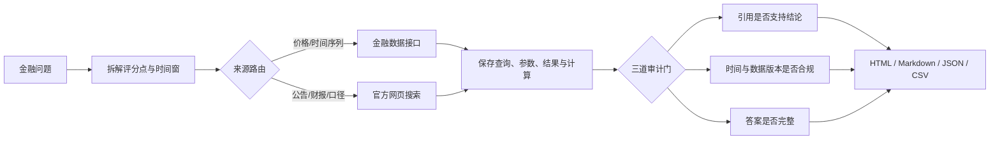

# FinSearchComp Audit Lab

> 一个可复现、可审计的金融搜索 Agent 实验：不仅保存最终答案，还保存搜索关键词、工具调用、计算过程、引用支持关系和时间有效性。

[](https://qiqiyzhu.github.io/FinSearchComp-Audit/)
[](https://github.com/QiQiyzhu/FinSearchComp-Audit/actions/workflows/finsearch-audit.yml)
[](https://www.python.org/)
[](LICENSE)

**English summary:** A reproducible audit layer for financial-search agents, with complete traces, source-support checks, temporal validation, and a web-search vs. financial-API comparison.

## 先看结果

- [在线审计报告](https://qiqiyzhu.github.io/FinSearchComp-Audit/)：适合浏览和演示；
- [`site/report.md`](site/report.md)：可直接阅读的中文实验报告；
- [`site/trace.json`](site/trace.json)：6 次运行的完整结构化轨迹；
- [`site/metrics.csv`](site/metrics.csv)：真实性、完整性和效率指标。

本仓库复现了 3 个成功案例和 3 个失败案例：

| 类型 | 案例 | 主要发现 |
|---|---|---|
| 成功 | S&P 500 最大单月涨幅 | April 2020，12.68% |
| 成功 | 2022 年首次加息后三个月最大回撤 | 20.83% |
| 成功 | Nasdaq 与 S&P 500 的 2024 年涨幅差 | 5.33 个百分点 |
| 失败 | 沪深指数比较只回答一半 | 浅层搜索停止过早 |
| 失败 | 中国经常账户 4220 / 4239 | 初步值与最终值版本冲突 |
| 失败 | NVIDIA 递延所得税资产 | 正确文件中选错财年列 |

## 60 秒复现

演示模式只依赖 Python 标准库，不需要 LLM API Key。

```bash
git clone https://github.com/QiQiyzhu/FinSearchComp-Audit.git
cd FinSearchComp-Audit
python reproduce.py
```

成功时会看到：

```text
[1/3] Validated 6 recorded runs (3 success, 3 failure)
[2/3] Generated 4 report artifacts in site
[3/3] Reproducibility checks passed
```

本地预览：

```bash
python -m http.server 8000 --directory site
```

然后访问 `http://localhost:8000`。

## 这个仓库比“只保存答案”多了什么？



传统结果文件通常只有 `question → answer`。本项目保留：

1. Agent 为什么选择这些关键词和来源；
2. 每次工具调用的参数、数据地址和结果摘要；
3. 从原始数字到最终答案的计算过程；
4. 每条引用是否真的支持结论；
5. 数据窗口、财年和版本是否满足题意；
6. 失败发生在检索、计算、引用还是时间对齐阶段。

## 审计标准

只有同时满足以下条件，案例才被判为“可信成功”：

```text
当前事实正确
AND 引用支持率 = 100%
AND 时间合规率 = 100%
AND 答案完整性 = 100%
```

| 维度 | 检查内容 |
|---|---|
| 真实性 | 关键结论能否映射到具体来源；财年、单位、币种、数据版本是否正确 |
| 完整性 | 是否逐项回答问题中的所有评分点 |
| 时间性 | 查询窗口是否完整；是否混用初步值、最终值或未来信息 |
| 效率 | 工具调用数、耗时、无效搜索和是否及时切换到结构化接口 |

## 网页搜索与金融接口如何分工

| 任务 | 首选工具 | 原因 |
|---|---|---|
| OHLC、收益率、回撤、长时间序列 | 金融数据接口 | 结构化、可批量、容易复算 |
| 公司财报、监管披露 | SEC / 公司官方文件 | 能核对表名、财年、单位和口径 |
| 宏观指标、政策公告 | 央行 / 统计机构 / 监管机构 | 需要确认发布日期和修订版本 |
| 定义与事件背景 | 官方网页 + 第二来源 | 需要语义解释和交叉验证 |

金融接口不是绝对正确：仍需明确 ticker、复权、时区和供应商口径。网页来源也不能仅凭“权威”通过审计，必须检查它是否具体支持最终结论。

## 项目结构

```text
.
├── reproduce.py                  # 一条命令：验证输入 → 生成报告 → 验证输出
├── audit/
│   ├── sample_runs.json          # 3 成功 + 3 失败的可复现输入
│   ├── run_demo.py               # HTML / Markdown / JSON / CSV 生成器
│   ├── validate_outputs.py       # 轨迹与产物语义验证
│   └── README.zh-CN.md           # 实验说明
├── docs/
│   └── REPRODUCIBILITY.md        # 环境、口径、预期结果和扩展方法
├── site/                         # 已生成的可发布结果
├── finsearchcomp/                # 上游 FinSearchComp 模型与评测代码
└── .github/workflows/            # 复现检查与 GitHub Pages 发布
```

## 两种运行模式

### 1. 审计演示模式（推荐先运行）

```bash
python reproduce.py
```

- 无 API Key；
- 秒级完成；
- 重点是轨迹、引用、时间和失败分析；
- 输出可直接发布到 GitHub Pages。

### 2. 上游基准模式

完整 FinSearchComp 包含 635 道 T1/T2/T3 问题，需要安装依赖并配置模型：

```bash
pip install -r finsearchcomp/requirements.txt
python finsearchcomp/chat/chat.py \
  --model_name gemini-2.5-flash \
  --input_file data/finsearchcomp_akshare_version.json \
  --output_path finsearchcomp/result/chat-result/chat.json \
  --limit 1
```

请通过环境变量或本地配置提供 API Key，不要把密钥提交到仓库。`--limit 1` 用于控制首次运行的成本。

## 复现与扩展

详细说明见 [`docs/REPRODUCIBILITY.md`](docs/REPRODUCIBILITY.md)。增加新案例时：

1. 在 `audit/sample_runs.json` 中添加结构化运行记录；
2. 保存查询词、工具调用、来源 URL、最终答案和审计结论；
3. 运行 `python reproduce.py`；
4. 确认本地验证和 GitHub Actions 均通过。

## 局限

- 当前审计集只有 6 个案例，不代表完整 635 题的总体性能；
- 成功案例主要覆盖指数与价格计算；
- Yahoo Finance 适合复算演示，但不是监管级官方行情源；
- 失败案例用于暴露检索、数据版本和财年对齐风险，不用于比较多个 LLM 的排名；
- 本项目不构成投资建议。

## 上游项目与引用

本仓库基于 [randomtutu/FinSearchComp](https://github.com/randomtutu/FinSearchComp)：

- [项目主页](https://randomtutu.github.io/FinSearchComp/)
- [论文：FinSearchComp: Towards a Realistic, Expert-Level Evaluation of Financial Search and Reasoning](https://arxiv.org/abs/2509.13160)
- [Hugging Face 数据集](https://huggingface.co/datasets/ByteSeedXpert/FinSearchComp)

```bibtex
@misc{hu2025finsearchcomprealisticexpertlevelevaluation,
  title={FinSearchComp: Towards a Realistic, Expert-Level Evaluation of Financial Search and Reasoning},
  author={Liang Hu and others},
  year={2025},
  eprint={2509.13160},
  archivePrefix={arXiv},
  primaryClass={cs.LG}
}
```
