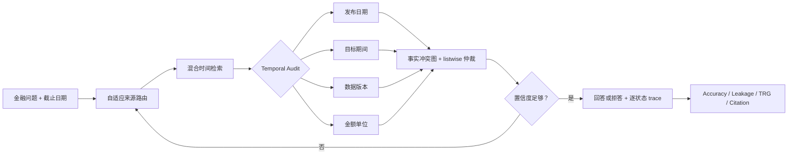
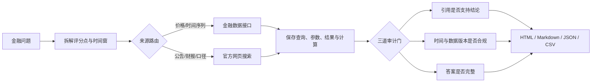

# FinSearchComp-Audit

> **Auditing Financial Research Agents: A Temporal Reliability Benchmark for Trustworthy Evaluation**

[](https://qiqiyzhu.github.io/FinSearchComp-Audit/)
[](https://qiqiyzhu.github.io/FinSearchComp-Audit/temporal-audit.html)
[](https://github.com/QiQiyzhu/FinSearchComp-Audit/actions/workflows/finsearch-audit.yml)
[](https://www.python.org/)

## 这个项目解决什么问题？

> 现有金融 Agent Benchmark 通常只检查最终答案是否正确。本项目进一步追问：<br>
> **Agent 使用的证据，在问题指定的时间点是否真的已经存在，并且是否属于正确的期间、版本和单位？**

一个答案可能“数字碰巧正确”，但仍然使用了未来发布的数据、修订后的最终值、
错误财年列或错误金额单位。对于金融研究，这类错误会造成时间穿越和虚假的回测结论。

| 项目要点 | 本仓库已经完成的内容 |
|---|---|
| 研究问题 | 把金融 Agent 评测从“答案正确”扩展为“答案、引用和时间版本同时可靠” |
| 受控数据 | 20 个真实金融问题 × 5 种证据条件，共 100 条实例 |
| 对照方法 | 普通 Agent、时间约束 Prompt、元数据过滤器、完整证据验证器 |
| 新指标 | Temporal Robustness Gap、时间违规率、扰动采用率、证据检测 F1 |
| 可解释输出 | 每题保存搜索策略、引用、日期/期间/版本/单位检查和拒答原因 |
| 真实 Agent | 新增 Sonnet 5 的 20题×5策略 ATLAS 对照；100 条有效 trace、214 次搜索、1,554 个完整来源和 481 条 citations |
| 高级 RAG | ATLAS-RAG：来源路由、纠错搜索、冲突仲裁、校准 Gate，以及复用五条真实轨迹的 ATLAS-Fusion |

**展示入口：**

- [打开在线项目首页](https://qiqiyzhu.github.io/FinSearchComp-Audit/)
- [查看 100 条时间可靠性实验](https://qiqiyzhu.github.io/FinSearchComp-Audit/temporal-audit.html)
- [查看 3 分钟演示稿](docs/TEACHER_DEMO.md)
- [查看真实 Agent 运行入口](temporal_clash/run_live_pilot.py)
- [查看正式实验协议与 Claude 中转门禁](docs/LIVE_STUDY_PROTOCOL.md)
- [查看最新 Sonnet 5 20×5 ATLAS 真实 pilot](temporal_clash/results/live_pilot_20q_atlas_sonnet5_20260813/README.md)
- [查看 ATLAS-Fusion 20 题跨轨迹仲裁](temporal_clash/results/atlas_fusion_20q_sonnet5_20260813/README.md)
- [查看 Claude Haiku 20×4 历史 pilot](temporal_clash/results/live_pilot_20q_claude_haiku_complete_20260813/README.md)
- [查看第一轮 Claude Sonnet 20×4 基线](temporal_clash/results/live_pilot_20q_claude_complete/README.md)
- [查看相关论文与升级路线](docs/LITERATURE_AND_ROADMAP.md)
- [查看 2024–2026 顶会 RAG 调研](docs/TOP_CONFERENCE_RAG_2026.md)
- [查看 ATLAS-RAG 实现与结果](advanced_rag/README.md)

## 项目演进总览

```text
12 条搜索审计案例
  → 20 个真实金融问题 × 5 类受控证据条件
  → 2024–2026 顶会 RAG 技术调研
  → ATLAS-RAG 自适应时间感知检索与冲突仲裁
  → Sonnet / Haiku 两轮真实 Web Search 验证（共 160 条有效 trace）
  → Sonnet 5 的 20×5 ATLAS 对照 + 20 题 ATLAS-Fusion 仲裁
```

| 阶段 | 解决的问题 | 主要产物 |
|---|---|---|
| 搜索审计 | 答案、引用、时间与工具调用是否可信 | 6 个成功 + 6 个失败轨迹 |
| 受控 Benchmark | 日期、期间、版本、单位错误能否被单独检测 | 100 条可复现实例与四策略消融 |
| 顶会调研 | 传统静态 Top-K RAG 下一步如何升级 | 2024–2026 正式顶会论文路线 |
| ATLAS-RAG | 如何把路由、时间排序、冲突处理和纠错连接起来 | 可解释状态机、离线指标与 JSON 服务 |
| 真实大模型 | 受控结论在开放网页上是否仍成立 | 最新 Sonnet 20×5 共 100 条有效 trace；保留早期 Sonnet/Haiku 两轮作历史复核 |
| ATLAS-Fusion | 五条独立搜索轨迹能否互补并解决证据冲突 | 20 次无新增搜索的结构化仲裁；最终 55%，初稿 65% |

## 顶会技术与项目模块的对应关系

| 研究方向 | 代表工作 | 本项目落地 |
|---|---|---|
| 自适应检索与路由 | Adaptive-RAG、R³AG、SPARKLE | 按行情、财报、官方统计和 Web 问题类型选择来源 |
| 相关性与时间新鲜度 | Re³ | 语义、截止日、期间、版本和来源效用联合排序 |
| 冲突感知证据融合 | Astute RAG、FaithfulRAG、SeCon-RAG | 事实冲突图与 listwise 来源仲裁 |
| 纠错检索与选择性回答 | Self-RAG、DRAGIN、ReflectiveRAG、Sufficient Context | 证据不足时改写搜索；区分明确冲突与元数据未知 |
| 模块化 RAG 评估 | RAGChecker | 分开报告 Recall、MRR、时间泄漏、覆盖率与选择性准确率 |

详细论文、正式会议链接、技术选择和诚实声明见
[顶会 RAG 调研与落地路线](docs/TOP_CONFERENCE_RAG_2026.md)。

## 初步实验结果

下表来自 100 条人工控制的证据冲突实例：

| 方法 | 决策准确率 ↑ | 挑战条件准确率 ↑ | TRG ↓ | 证据检测 F1 ↑ |
|---|---:|---:|---:|---:|
| 普通 Agent | 20.0% | 0.0% | 100.0% | 0.0% |
| 时间约束 Prompt | 40.0% | 25.0% | 75.0% | 40.0% |
| 元数据过滤器 | 80.0% | 75.0% | 25.0% | 85.7% |
| 完整证据验证器 | **100.0%** | **100.0%** | **0.0%** | **100.0%** |

**如何理解：** 仅在 Prompt 中提醒“不要使用未来信息”还不够；显式检查
发布日期、目标期间、数据版本和单位，才能稳定拒绝受污染证据。

> **实验边界：** 这张表验证的是受控协议和消融关系，不是真实 LLM 排名。
> 完整验证器能达到 100%，是因为测试集中的冲突元数据已人工标注。
> 下方真实搜索 pilot 已开始检验开放网页中的隐含日期、缺失元数据和检索噪声。

## ATLAS-RAG 高级检索升级

受 Re³、R³AG、GRIP、E²RAG、Astute RAG 等工作启发，本仓库新增一个依赖轻量、可解释的高级 RAG 原型：

```text
自适应来源路由
→ BM25 / 确定性向量特征 / 时间兼容性 / 来源效用融合
→ 日期、期间、版本、单位审计
→ 事实级冲突图与 listwise 仲裁
→ 低置信度纠错检索
→ 回答或拒答
```

在清除候选 ID、`synthetic://` URL 和人工扰动提示等标签泄漏信号后，20 个真实金融问题、
100 个去重证据文档的离线结果为：

| 方法 | Recall@5 ↑ | MRR@10 ↑ | Top-5 未来证据率 ↓ |
|---|---:|---:|---:|
| BM25 | 95% | 0.563 | 37% |
| Hybrid RRF | 95% | 0.642 | 42% |
| ATLAS temporal | **100%** | **0.929** | **30%** |

端到端 20 题决策准确率和回答覆盖率均为 95%；已回答样本准确率为 100%，5% 的问题触发纠错检索。
这是受控离线实验，不是论文原方法复现或真实 Web 的 SOTA 声明。完整结果与边界见
[ATLAS-RAG 说明](advanced_rag/README.md)和[生成结果](advanced_rag/results/README.md)。

## 真实 Agent pilot

### 最新升级：Claude Sonnet 5 × ATLAS-RAG（2026-08-13）

针对第一轮“缺失日期被当成违规、单轮检索不足、来源没有路由、证据冲突没有仲裁”的失败，
本轮先冻结 [`live-atlas-1.1` 协议](docs/LIVE_ATLAS_PROTOCOL.md)，再在同一个
`claude-sonnet-5`、同一 20 题和相同每策略最多 3 次 Web Search 条件下运行五策略：

| 策略 | 最终决策准确率 | 模型初稿准确率 | 回答覆盖率 | 已采用证据时间泄漏 |
|---|---:|---:|---:|---:|
| 普通搜索 Agent | **55%** | 55% | **75%** | 0% |
| 时间约束 Prompt | **55%** | 55% | 70% | 0% |
| 元数据过滤器 | 40% | 55% | 40% | 0% |
| 完整证据验证器 | 35% | 55% | 40% | 0% |
| ATLAS-RAG（校准版） | 45% | 45% | 50% | 0% |

100/100 条 trace 全部通过严格校验；实际发生 214 次 Web Search、捕获 1,554 个完整来源和
481 条原生 citations，对应 200 个成功 HTTP 阶段且没有 transport/invalid 记录。单轨迹
ATLAS 比同轮完整验证器提高 **10 个百分点**、覆盖率提高 **10 个百分点**、Gate 触发率从
25% 降到 10%，证明“把 metadata unknown 与明确冲突分开”确实缓解了严格 Gate 的过度拒答；
但它仍比普通 Agent 低 10 个百分点，因此不能宣称已经全面超过普通搜索。

随后执行探索性 `ATLAS-Fusion`：每题复用五条已锁定搜索轨迹，不新增搜索，只增加一次
Sonnet listwise 仲裁。其最终准确率为 **55%**，与普通 Agent 持平；仲裁初稿达到 **65%**，
等于五轨迹 oracle 上限 13/20，但 Gate 又拒掉部分正确派生答案。这个结果说明下一瓶颈已从
“是否搜到互补证据”收敛到“派生单位与选择性拒答校准”。由于该问题是在查看 20 题结果后
发现，本仓库不继续用同一测试集调阈值；下一轮应使用新的开发/测试拆分。

- [20×5 主实验研究卡](temporal_clash/results/live_pilot_20q_atlas_sonnet5_20260813/README.md)
- [ATLAS-Fusion 研究卡](temporal_clash/results/atlas_fusion_20q_sonnet5_20260813/README.md)
- [冻结协议与两次门禁修订记录](docs/LIVE_ATLAS_PROTOCOL.md)

### 第二轮：Claude Haiku 4.5（2026-08-13）

先完成 1 题 × 4 策略小样本，确认真实搜索、来源和引用均通过后，再按第一轮相同规模运行
**20 题 × 4 策略**。最终 80/80 个 case–strategy 单元通过严格校验：

| 策略 | 最终决策准确率 | 模型初稿准确率 | 回答覆盖率 | 已采用证据时间泄漏 |
|---|---:|---:|---:|---:|
| 普通搜索 Agent | 25% | 25% | 35% | 28.6% |
| 时间约束 Prompt | 15% | 15% | 15% | 0% |
| 元数据过滤器 | 15% | 15% | 15% | 0% |
| 完整证据验证器 | 10% | 10% | 10% | 0% |

本轮实际调用 `claude-haiku-4-5-20251001`，执行 80 次 Web Search，捕获 800 个来源、
152 条原生 citations，使用 376,653 个输入 token 和 35,009 个输出 token。严格策略消除了
最终采用证据中的时间泄漏，但回答覆盖率显著下降，进一步支持“开放网页元数据缺失会造成
过度拒答”的结论。完整数据包见
[第二轮研究卡](temporal_clash/results/live_pilot_20q_claude_haiku_complete_20260813/README.md)。

### 第一轮：Claude Sonnet 5（2026-07-31）

2026-07-31 已使用中转实际列出的 `claude-sonnet-5`，完成全部预定的
**20 题 × 4 策略**，共 80 条严格验证 trace：

| 策略 | 最终决策准确率 | 模型草稿准确率 | 答案覆盖率 | 引用覆盖率 | 完整来源覆盖率 |
|---|---:|---:|---:|---:|---:|
| 普通搜索 Agent | 50% | 50% | 65% | 100% | 100% |
| 时间约束 Prompt | 45% | 45% | 65% | 100% | 100% |
| 元数据过滤器 | 25% | 45% | 30% | 100% | 100% |
| 完整证据验证器 | 20% | 40% | 25% | 100% | 100% |

结果没有复制受控样例中的单调提升：严格策略虽然把最终采用证据的时间泄漏保持为 0，
但开放网页经常缺少可验证日期，导致过度拒答并降低覆盖率和最终准确率。元数据过滤器和
完整验证器共有 8 条正确模型初稿最终被拒答，分布在 6 道题。这是当前 pilot 最重要的
真实发现，也把下一步聚焦到独立元数据获取和拒答校准。

本轮保存 167 次 Web Search、1,228 个完整来源和 256 条原生 citations。80 个成功运行
对应 160 个成功 HTTP 阶段；加上早期 4 次中转断线，总请求次数位于 164–168，
未超过批准上限 168。完整 trace、20 道中文逐题说明、bootstrap 区间和排除记录见
[真实 pilot 研究卡](temporal_clash/results/live_pilot_20q_claude_complete/README.md)。

## 方法概览



## 三层实验如何连接

| 层次 | 输入 | 输出 | 当前状态 |
|---|---|---|---|
| 搜索审计案例 | 12 条保存的金融 Agent 轨迹 | 成功/失败分析、引用支持、时间合规、完整 trace | 已完成 |
| 受控时间 Benchmark | 20 个问题、100 条干净或扰动证据 | 四策略对照表、TRG、泄露检测 F1 | 已完成 |
| 真实 Web Search pilot | 最新 20 个问题 × 5 个策略；另保留两轮历史基线 | 100 条最新有效 trace、来源、逐题、置信区间和聚合指标 | Sonnet 5 ATLAS 同轮对照已完成；独立新题待做 |
| ATLAS-Fusion | 每题 5 条已锁定真实搜索轨迹 | 20 条仲裁 trace、最终/初稿准确率与成本 | 已完成；最终 55%，初稿 65%，不作同预算优越声明 |
| ATLAS-RAG 离线检索 | 20 个问题、100 个去重证据文档 | Recall/MRR、未来证据率、冲突图、选择性回答 trace | 原型与真实语料第一轮验证均已完成 |

## 我的具体贡献

1. 将“未来信息泄露”从模型记忆问题扩展到 **Agent 检索证据是否满足 point-in-time 约束**；
2. 构建日期、期间、版本和单位四类人工扰动的 100 条受控测试集；
3. 实现可解释的 Temporal Evidence Gate，以及答案选择与证据检测两组指标；
4. 接入真实 Web Search Agent，同时保留同一数据、指标和逐题 trace 接口；
5. 实现 ATLAS-RAG 的路由、混合时间检索、冲突图、纠错检索、选择性回答和线程化 JSON 服务；
6. 在 20×5 同模型实验中验证校准 Gate，并实现不读取 gold 标签的跨轨迹 ATLAS-Fusion。

## 3 分钟展示顺序

1. **30 秒：** 阅读本页的研究问题和初步实验表；
2. **60 秒：** 打开[时间可靠性页面](https://qiqiyzhu.github.io/FinSearchComp-Audit/temporal-audit.html)，展示未来证据、错期间、错版本、错单位四种 trace；
3. **45 秒：** 打开[搜索审计主页](https://qiqiyzhu.github.io/FinSearchComp-Audit/)，说明为什么只保存最终答案不够；
4. **30 秒：** 展示[正式真实 Agent 协议](docs/LIVE_STUDY_PROTOCOL.md)，说明四项硬门禁、费用上限和重复实验设计；
5. **15 秒：** 用 `python reproduce.py` 说明整个受控实验无需 API Key、可以一键复现。

## 一键复现

```bash
git clone https://github.com/QiQiyzhu/FinSearchComp-Audit.git
cd FinSearchComp-Audit
python reproduce.py
```

该命令验证 12 条保存轨迹，运行 100 条受控实例，评测 ATLAS-RAG，并重新生成 GitHub Pages。
真实搜索 pilot 默认只显示费用计划，不会发出 API 请求：

```bash
python -m temporal_clash.run_live_pilot
```

## 当前结论与下一步

- **现在可以证明：** 显式元数据验证比仅靠 Prompt 更能抵抗受控的时间、期间、版本和单位冲突；
- **现在不能声称：** 某个真实 LLM 或搜索产品已经在完整金融任务上达到 100%；
- **真实 pilot 发现：** ATLAS 将同轮完整验证器从 35% 提高到 45%，但仍未超过普通 Agent 的 55%；
- **跨轨迹融合：** ATLAS-Fusion 最终 55%、初稿 65%，证明互补证据有价值，也暴露派生单位 Gate 的新瓶颈；
- **高级 RAG 原型：** ATLAS-RAG 已完成离线路由、检索、冲突仲裁、纠错、服务化、真实搜索和标签泄漏审计；
- **下一步：** 在全新开发集定义派生单位与风险—覆盖率规则，再用独立测试集验证；同时独立抓取网页发布日期并加入真实 dense encoder。

<details>
<summary><b>展开技术细节、案例清单和上游 FinSearchComp 说明</b></summary>

# FinSearchComp Audit Lab

> 一个可复现、可审计的金融搜索 Agent 实验：不仅保存最终答案，还保存搜索关键词、工具调用、计算过程、引用支持关系和时间有效性。

[](https://qiqiyzhu.github.io/FinSearchComp-Audit/)
[](https://github.com/QiQiyzhu/FinSearchComp-Audit/actions/workflows/finsearch-audit.yml)
[](https://www.python.org/)
[](LICENSE)

**English summary:** A reproducible audit layer for financial-search agents, with complete traces, source-support checks, temporal validation, and a web-search vs. financial-API comparison.

## 先看结果

- [在线审计报告](https://qiqiyzhu.github.io/FinSearchComp-Audit/)：适合浏览和演示；
- [时间可靠性实验](https://qiqiyzhu.github.io/FinSearchComp-Audit/temporal-audit.html)：100 条受控实例、Temporal Leakage Detector 指标与逐证据 trace；
- [`site/report.md`](site/report.md)：可直接阅读的中文实验报告；
- [`site/trace.json`](site/trace.json)：12 次运行的完整结构化轨迹；
- [`site/metrics.csv`](site/metrics.csv)：真实性、完整性和效率指标。

本仓库复现了 6 个成功案例和 6 个失败案例：

| 类型 | 案例 | 主要发现 |
|---|---|---|
| 成功 | S&P 500 最大单月涨幅 | April 2020，12.68% |
| 成功 | 2022 年首次加息后三个月最大回撤 | 20.83% |
| 成功 | Nasdaq 与 S&P 500 的 2024 年涨幅差 | 5.33 个百分点 |
| 成功 | Apple 2024 财年净销售额 | 3,910.35 亿美元；SEC 财报单位换算正确 |
| 成功 | 美国 2024 年末 CPI 同比 | 2.9%；区分同比、环比与季调口径 |
| 成功 | 美联储 2024 年 9 月降息 | 50 个基点，目标区间降至 4.75%–5.00% |
| 失败 | 沪深指数比较只回答一半 | 浅层搜索停止过早 |
| 失败 | 中国经常账户 4220 / 4239 | 初步值与最终值版本冲突 |
| 失败 | NVIDIA 递延所得税资产 | 正确文件中选错财年列 |
| 失败 | NVIDIA 2024 年拆股 | 未复权比较制造 88.89% 虚假暴跌 |
| 失败 | Tesla 2024 年研发费用 | 忽略“百万美元”表头，结果缩小千倍 |
| 失败 | S&P 500 2024 年收益率 | 用首个交易日代替上年末，年度边界错误 |

## 60 秒复现

演示模式只依赖 Python 标准库，不需要 LLM API Key。

```bash
git clone https://github.com/QiQiyzhu/FinSearchComp-Audit.git
cd FinSearchComp-Audit
python reproduce.py
```

该命令会同时复现两部分：12 条保存的金融搜索 Agent 轨迹，以及 100 条时间/期间/版本/单位受控冲突实例。

真实搜索 Agent 的 20 题 × 4 策略结果已经发布；runner 也提供重复和多模型实验入口。
默认命令只输出调用与费用计划，不会发送 API 请求：

```bash
python -m temporal_clash.run_live_pilot
```

成功时会看到：

```text
[1/4] Validated 12 recorded runs (6 success, 6 failure)
[2/4] Generated core audit artifacts in site
[3/4] Temporal detector benchmark and report generated
[4/4] All reproducibility and site-link checks passed
```

本地预览：

```bash
python -m http.server 8000 --directory site
```

然后访问 `http://localhost:8000`。

## 这个仓库比“只保存答案”多了什么？



传统结果文件通常只有 `question → answer`。本项目保留：

1. Agent 为什么选择这些关键词和来源；
2. 每次工具调用的参数、数据地址和结果摘要；
3. 从原始数字到最终答案的计算过程；
4. 每条引用是否真的支持结论；
5. 数据窗口、财年和版本是否满足题意；
6. 失败发生在检索、计算、引用还是时间对齐阶段。

## 审计标准

只有同时满足以下条件，案例才被判为“可信成功”：

```text
当前事实正确
AND 引用支持率 = 100%
AND 时间合规率 = 100%
AND 答案完整性 = 100%
```

| 维度 | 检查内容 |
|---|---|
| 真实性 | 关键结论能否映射到具体来源；财年、单位、币种、数据版本是否正确 |
| 完整性 | 是否逐项回答问题中的所有评分点 |
| 时间性 | 查询窗口是否完整；是否混用初步值、最终值或未来信息 |
| 效率 | 工具调用数、耗时、无效搜索和是否及时切换到结构化接口 |

## 网页搜索与金融接口如何分工

| 任务 | 首选工具 | 原因 |
|---|---|---|
| OHLC、收益率、回撤、长时间序列 | 金融数据接口 | 结构化、可批量、容易复算 |
| 公司财报、监管披露 | SEC / 公司官方文件 | 能核对表名、财年、单位和口径 |
| 宏观指标、政策公告 | 央行 / 统计机构 / 监管机构 | 需要确认发布日期和修订版本 |
| 定义与事件背景 | 官方网页 + 第二来源 | 需要语义解释和交叉验证 |

金融接口不是绝对正确：仍需明确 ticker、复权、时区和供应商口径。网页来源也不能仅凭“权威”通过审计，必须检查它是否具体支持最终结论。

## 项目结构

```text
.
├── reproduce.py                  # 一条命令：验证输入 → 生成报告 → 验证输出
├── audit/
│   ├── sample_runs.json          # 6 成功 + 6 失败的可复现输入
│   ├── run_demo.py               # HTML / Markdown / JSON / CSV 生成器
│   ├── validate_outputs.py       # 轨迹与产物语义验证
│   └── README.zh-CN.md           # 实验说明
├── docs/
│   └── REPRODUCIBILITY.md        # 环境、口径、预期结果和扩展方法
├── site/                         # 已生成的可发布结果
├── finsearchcomp/                # 上游 FinSearchComp 模型与评测代码
└── .github/workflows/            # 复现检查与 GitHub Pages 发布
```

## 两种运行模式

### 1. 审计演示模式（推荐先运行）

```bash
python reproduce.py
```

- 无 API Key；
- 秒级完成；
- 重点是轨迹、引用、时间和失败分析；
- 输出可直接发布到 GitHub Pages。

### 2. 上游基准模式

完整 FinSearchComp 包含 635 道 T1/T2/T3 问题，需要安装依赖并配置模型：

```bash
pip install -r finsearchcomp/requirements.txt
python finsearchcomp/chat/chat.py \
  --model_name gemini-2.5-flash \
  --input_file data/finsearchcomp_akshare_version.json \
  --output_path finsearchcomp/result/chat-result/chat.json \
  --limit 1
```

请通过环境变量或本地配置提供 API Key，不要把密钥提交到仓库。`--limit 1` 用于控制首次运行的成本。

## 复现与扩展

详细说明见 [`docs/REPRODUCIBILITY.md`](docs/REPRODUCIBILITY.md)。增加新案例时：

1. 在 `audit/sample_runs.json` 中添加结构化运行记录；
2. 保存查询词、工具调用、来源 URL、最终答案和审计结论；
3. 运行 `python reproduce.py`；
4. 确认本地验证和 GitHub Actions 均通过。

## 新增：100 条时间与版本冲突测试集

`temporal_clash/` 提供一个独立、无 API Key 的小型受控实验：20 个真实金融问题分别配套干净证据、未来证据、错期间、错单位和错版本，共 100 条。四个确定性代理策略对应普通 Agent、时间约束 Prompt、元数据过滤器和 TEG 验证器。

```bash
python -m temporal_clash.run_experiment --check
```

这张初步表用于验证实验设计和消融关系，不是 LLM 排名。数据说明、指标、逐题输出和研究边界见 [`temporal_clash/README.zh-CN.md`](temporal_clash/README.zh-CN.md)。

## 局限

- 当前审计集有 12 个案例，仍不代表完整 635 题的总体性能；
- 成功案例覆盖指数计算、公司财报、宏观统计和货币政策公告；
- Yahoo Finance 适合复算演示，但不是监管级官方行情源；
- 失败案例覆盖检索深度、数据版本、财年列、拆股复权、金额单位和年度边界，不用于比较多个 LLM 的排名；
- 本项目不构成投资建议。

## 上游项目与引用

本仓库基于 [randomtutu/FinSearchComp](https://github.com/randomtutu/FinSearchComp)：

- [项目主页](https://randomtutu.github.io/FinSearchComp/)
- [论文：FinSearchComp: Towards a Realistic, Expert-Level Evaluation of Financial Search and Reasoning](https://arxiv.org/abs/2509.13160)
- [Hugging Face 数据集](https://huggingface.co/datasets/ByteSeedXpert/FinSearchComp)

```bibtex
@misc{hu2025finsearchcomprealisticexpertlevelevaluation,
  title={FinSearchComp: Towards a Realistic, Expert-Level Evaluation of Financial Search and Reasoning},
  author={Liang Hu and others},
  year={2025},
  eprint={2509.13160},
  archivePrefix={arXiv},
  primaryClass={cs.LG}
}
```

</details>
