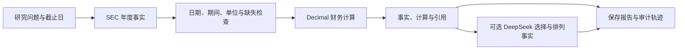

# FinAgent 金融研究工作台：从论文到工程

核验日期：2026-09-22。本文解释本次产品实现的来源与边界；既有 ATLAS 实验的成绩仍归属于原实验，不能作为新工作台的准确率或生产表现。

## 产品要解决的问题

用户输入公司与研究问题后，需要得到可核对的年度财务事实、计算过程、基本面总结和下一步研究建议。面试官可以先从[在线工作台](https://qiqiyzhu.github.io/FinSearchComp-Audit/workbench/)体验固定案例，再根据仓库首页启动完整服务。

本版本先把美股年度基本面研究做成一条完整流程：公司识别 → SEC 结构化事实检索 → 历史截止日筛选 → 财务计算 → 带引用的报告 → 保存与导出。当前“搜索”主要指对 SEC Company Facts 的定向查询，不等同于开放网页深度搜索，也不覆盖实时行情、所有金融市场或券商研报库。

## 参考产品，学习工作流

以下是根据厂商公开文档做出的设计取舍，没有对这些商业产品进行同条件效果评测，也没有接入其付费数据。

| 官方来源 | 可以借鉴的产品行为 | 工作台中的取舍 |
|---|---|---|
| [Rogo 产品官网](https://rogo.com/) | 从金融工作流出发，交付研究备忘录、尽调材料和可审计模型；接入企业与金融数据 | 用研究报告作为任务结果，呈现事实、计算、观点、缺口；本版不生成完整估值 Excel，也不接入企业内部文档 |
| [AlphaSense Generative Search](https://www.alpha-sense.com/solutions/generative-ai-industry-company-research/)、[官方 API 文档](https://developer.alpha-sense.com/agent-api/gensearch) | 自然语言问题、来源支持的回答和深入研究；公开产品说明强调可回查的原文片段引用 | 让指标和结论可以回到证据记录及申报文件；当前引用粒度是结构化事实及 filing，不冒充已完成全文语义蕴含验证 |
| [RavenPack Bigdata 开发者页面](https://bigdata.com/developers)、[Research Agent API](https://docs.bigdata.com/api-reference/research-agent/research-agent) | 把搜索、实体解析、结构化输出、过程事件和研究服务做成可组合接口 | 将数据适配、计算、模型解释、API 与持久化分开；当前没有其知识图谱、新闻覆盖、SSE 研究流或市场数据授权 |

## 论文方法怎样落地

v2 进一步参考 [Rogo Agent Library](https://rogo.com/news/agent-library) 中的任务型工作流，以及 [AlphaSense 响应文档](https://developer.alpha-sense.com/agent-api/response-parsing)中的可回查引用与结构化比较。具体落实为“公司研究 / 公司对比 / 质量验证”三个入口、问题级答案和来源抽屉；没有接入这些产品的内容库或声称达到其研究覆盖。

这轮的质量改进可以独立检查：多主题问题逐项规划、派生操作逐项计算；公司对比隔离发行人引用，只有相同年度起止日和单位才计算差额。[质量协议与结果](WORKBENCH_QUALITY.md)将正确数值、完整回答、拒答和时间边界分别计分，旧版来源固定为 Git 提交 `d8ae038`。

| 论文及已核验方法 | 本次已实现的工程吸收 | 尚未实现、不能宣称的部分 |
|---|---|---|
| [EvidenceLoop / WebDetective，ICLR 2026](https://proceedings.iclr.cc/paper_files/paper/2026/hash/9a27f07ee41dd59d527062e045c16353-Abstract-Conference.html)：分开评价搜索充分性、知识利用与拒答；EvidenceLoop 用 EID 保留证据，并验证原子陈述 | 为事实分配证据 ID，保留来源与哈希；派生指标记录操作数引用；证据缺失与计算失败具有可见状态 | 没有复现论文的并行 solver、全文记忆检索和多轮 LLM 验证循环；规则检查不等于对模型文字的语义证明。方法细节见[论文 §3、Appendix E](https://proceedings.iclr.cc/paper_files/paper/2026/file/9a27f07ee41dd59d527062e045c16353-Paper-Conference.pdf) |
| [Deliberative Searcher，ACL 2026](https://aclanthology.org/2026.acl-long.199/)：用约束强化学习联合优化正确性与信心行为，再做信心加权聚合 | 将数据检查与模型解释分开；缺失信息不由模型自报信心补齐；基本面判断写明条件与研究缺口 | 没有训练约束 RL，也没有概率校准或信心加权多轨迹。工作台的检查结果不是“投资成功概率” |
| [FinKario，ACL 2026](https://aclanthology.org/2026.acl-long.446/)：通过属性图和事件图组织金融知识，再做两阶段图检索 | 仅借鉴“实体、指标、期间、来源必须一起保存”的数据建模思想 | 本版本没有事件图、图数据库、两阶段图检索或股票涨跌预测复现；论文回测收益与本项目无关。图方法见[论文 §3](https://aclanthology.org/2026.acl-long.446.pdf) |

这些方法的共同启发是：系统应当能解释证据从哪里来、采用了什么口径、何时必须停下。论文成绩不能直接转移到另一个模型、数据源或任务。

## 与原项目的关系

[ATLAS-PIT-XBRL 协议](ATLAS_PIT_XBRL_20Q_PROTOCOL.md)已经把历史截止日、SEC 年度事实、确定性公式和来源审计作为研究对象。[原平台](../finagent_platform/README.md)把实验封装成带任务状态、幂等和回放的软件服务。

新工作台在这些经验上扩展产品体验与基本面报告，实现在独立的 [research_workbench](../research_workbench/) 模块。[sources.py](../research_workbench/sources.py)负责事实与时间筛选，[engine.py](../research_workbench/engine.py)负责规则规划、计算、引用检查和摘要编排。原实验的题目、模型、对照工具、计分协议与工作台不同；回归测试通过也不等于有了新的端到端研究质量基准。

## 数据与判断的契约

- **日期有三种含义。** `period_end` 是经济期间结束，`filed` 是 SEC 申报日期，`retrieved_at` 是本次下载时间。历史筛选要求期间结束日和申报日均不晚于 `as_of`；今天下载的数据可以含有符合历史截止日的旧记录，但不能因此称为当年已经保存的数据库快照。
- **财年需要明确。** MSFT、AAPL、NVDA 的财年结束日不同；同名 FY2024 不代表相同自然年度。年度持续时间与申报类型必须符合规则，利润率与现金流计算的操作数需要期间对齐。
- **公式由代码执行。** 金额采用 `Decimal`，收入增长、利润率等采用固定公式。缺失数据保持缺失，不默认为零；自由现金流采用明确的支出口径，不能把不同公司的 PP&E、无形资产和融资租赁项目随意互换。
- **模型负责受限编排。** DeepSeek 仅能返回允许的 `claim_ids` 和 `watch_ids`，选择、排列已有事实与后续核验动作；展示文字来自确定模板。模型不生成新的财务事实或自由文本分析。无法调用或返回无效 ID 时，报告显示实际模型状态并保留确定性摘要。
- **证据检查限定含义。** 引用记录、哈希及时间检查证明的是系统采用了哪些数据、数据是否符合规则；它们不证明 SEC 报告本身没有错，也不证明模型的商业解释成立。
- **判断是有条件的研究观点。** 年度财报可以支持增长、盈利与现金转换分析；缺少价格、估值假设和持仓约束时，不能推出买卖点、目标价或适合个人的仓位建议。

当前基本面信号分别查看收入变化、营业和净利润率变化、自由现金流、现金转换及资本支出压力，并绑定操作数证据。正反信号并存时明确标为“信号分化”，不按信号数量投票；请求未答完整时保留判断。规则未做预测效果或概率校准。可选 Tavily 接口只补充带日期、待人工核验的来源发现，搜索摘要不进入已验证财务事实链。

SEC 官方说明 Company Facts API 的数据来源、taxonomy 与接口方式；它不是新闻检索或价格接口。实现与数据接入边界可对照 [SEC EDGAR API 文档](https://www.sec.gov/search-filings/edgar-application-programming-interfaces)。

## 演示数据核验记录

以下用于核对演示输入，不是模型预测。金额为 **百万美元**，顺序为 **FY2024 / FY2023**；演示采用历史截止日，不能标成今天的公司最新财务表现。

已独立检查[打包数据](../research_workbench/data/demo_companyfacts.json)及[原始响应压缩文件](../research_workbench/data/upstream/)：三个原始响应解压后的 SHA-256 均与记录一致，表内 11 组指标的两年数值与所核验年报一致，且对应记录确实存在于原始响应。抓取时间为 `2026-09-22T11:59:35+00:00`，可用性截止日为 `2024-11-01`。这是演示输入核验，不是新模型准确率评测。

| 公司 | 营收 | 营业利润 | 经营现金流 | PP&E 现金支出 | FY2024 10-K 申报日 |
|---|---:|---:|---:|---:|---|
| Microsoft | 245,122 / 211,915 | 109,433 / 88,523 | 118,548 / 87,582 | 44,477 / 28,107 | 2024-07-30 |
| Apple | 391,035 / 383,285 | 123,216 / 114,301 | 118,254 / 110,543 | 9,447 / 10,959 | 2024-11-01 |
| NVIDIA | 60,922 / 26,974 | 32,972 / 4,224 | 28,090 / 5,641 | 不以混合科目代填 | 2024-02-21 |

Microsoft 数值对照官方[损益表](https://www.microsoft.com/en-us/investor/earnings/fy-2024-q4/income-statements)与[现金流量表](https://www.microsoft.com/en-us/investor/earnings/fy-2024-q4/cash-flows)，申报日期对照 [SEC filing index](https://www.sec.gov/Archives/edgar/data/789019/000095017024087843/0000950170-24-087843-index.htm)。Apple 对照 [2024 Form 10-K](https://www.sec.gov/Archives/edgar/data/320193/000032019324000123/aapl-20240928.htm)与[申报索引](https://www.sec.gov/Archives/edgar/data/320193/000032019324000123/0000320193-24-000123-index.htm)。

NVIDIA 对照 [2024 Form 10-K](https://www.sec.gov/Archives/edgar/data/1045810/000104581024000029/nvda-20240128.htm)与[申报索引](https://www.sec.gov/Archives/edgar/data/1045810/000104581024000029/0001045810-24-000029-index.htm)。该现金流量表中的 1,069 / 1,833 包含 PP&E **及无形资产**，因此不当作统一 PP&E 科目填入；29,760 是 FY2024 净利润，也不能误填为营业利润。

## 下一步怎样验证价值

1. v2 已新增冻结问题评测；下一步需要由外部标注者扩大公司、年度和表达覆盖，并补充重述、标签变化等难例。当前项目内编写的有限评测不能替代真实投研任务验证。
2. 在同一数据与调用预算下比较规则报告、直接生成、带证据生成；由独立标注者检查数值正确、引用支持、遗漏和观点越界，避免只靠模型自评。
3. 接入有明确使用授权的新闻与电话会资料后，再评估全文检索、事件抽取和 EvidenceLoop 式验证循环，保留每条陈述的来源与可用时间。
4. 有真实用户与负载后，再验证认证隔离、任务恢复、备份、成本限额和服务水平；当前单机部署成果不能替代这些生产验证。
