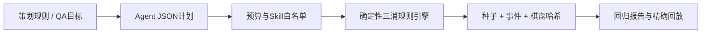

# Match-3 Agent QA Lab

这是 ATLAS 工程原则在游戏 QA 场景中的小型技术迁移：Agent 可以规划和选择技能，但不负责判定答案；交换合法性、匹配、重力、补充、级联、计分和回放均由确定性规则引擎裁决。

## 为什么它属于本项目

ATLAS-PIT-XBRL 使用“模型做语义规划、程序做事实与公式验证”来降低幻觉和时间泄漏。这里使用同一边界处理游戏测试：模型未来可以根据策划需求生成 JSON 测试计划，但只能调用白名单技能；规则引擎返回可复现的 pass/fail、棋盘哈希和事件 trace。



## 可演示能力

- 客户端工程：纯状态转换、邻接交换、横纵匹配、重力补充、多次级联、跨语言可复现 PRNG、事件回放；
- 测试工程：死局检测、固定 seed 回归、属性测试、非法工具参数失败闭锁、预算耗尽不改变状态；
- 产品分析：可玩步数、符号分布、难度代理指标和风险标记，且明确不把启发式分数冒充真实玩家难度；
- Agent 工程：JSON Schema 风格的 Skill catalog、只允许白名单动作、读写技能分离、成本预算、全链路 trace。

## 一键运行

只依赖 Python 3.11 标准库：

```bash
python -m unittest game_qa_agent.test_game_qa_agent -v
python -m game_qa_agent --output site/game-qa
```

生成的 `report.json`、`trace.json` 和 `README.md` 可以进入 CI artifact 或静态站点。内置样例包含一个 5 步可玩棋盘、一个死局棋盘，以及一个固定为 3 次级联、消除 12 格、得分 2400 的回归动作。

## 边界

- 当前是规则与 Agent 工具边界的离线 MVP，不是完整 Unity 客户端；
- `difficulty_proxy` 只用于测试排序，不代表真实玩家胜率、留存或商业难度；
- 当前没有调用付费模型。接入任意模型时，应让模型只输出受 schema 约束的计划，并保留人工审批、调用预算与 trace；
- 若迁移到 Unity/C#，事件结构、xorshift32、棋盘哈希和场景 JSON 可作为跨实现契约，使用 EditMode/PlayMode 测试做一致性校验。
